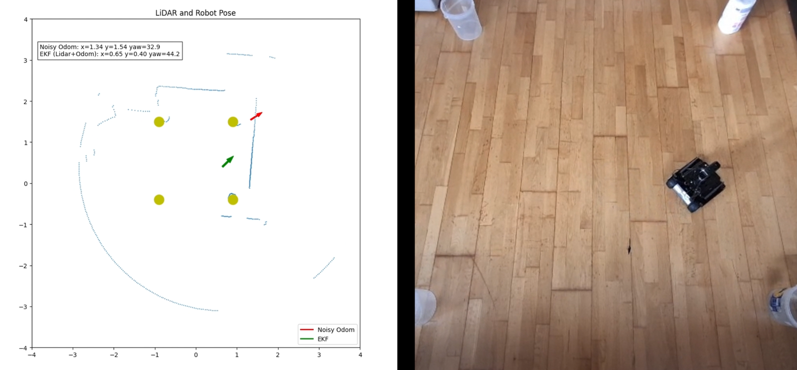

# Beacon-Based UGV Localization with LiDAR and Odometry using EKF



A simple and practical ROS 2 Python project for **2D robot localization** using:

- **wheel odometry**
- **2D LiDAR**
- **known cylindrical landmarks**
- **Extended Kalman Filter (EKF)**

This project is designed to be:

- easy to understand
- easy to modify
- easy to test in simulation or on a real robot

It also includes optional parts useful for **sim-to-real transfer**, such as:

- LiDAR scan shifting
- simple LiDAR filtering
- odometry noise injection for robustness testing

> **Important:** Before using this code in a new robot or a new environment, you must adapt the beacon positions, cylinder dimensions, LiDAR alignment, and other tuning parameters.

---

## Media and Project Presentation

For videos, media files, and the PowerPoint presentation that explains the project, see the shared Google Drive folder below:

**Project media and presentation:**  
<https://drive.google.com/drive/folders/1NxWmso-a9QZD_wPNid16bSE5ARKj8Jmd?usp=sharing>

---

## Table of Contents

- [1. Overview](#1-overview)
- [2. What This Project Does](#2-what-this-project-does)
- [3. Main Idea](#3-main-idea)
- [4. Features](#4-features)
- [5. Repository Content](#5-repository-content)
- [6. Requirements](#6-requirements)
- [7. Topics Used](#7-topics-used)
- [8. Quick Start](#8-quick-start)
- [9. How the Code Works](#9-how-the-code-works)
- [10. Important Parameters to Adapt](#10-important-parameters-to-adapt)
- [11. Adapting to a New Environment](#11-adapting-to-a-new-environment)
- [12. Sim-to-Real Notes](#12-sim-to-real-notes)
- [13. Visualization](#13-visualization)
- [14. Motion Modes for Testing](#14-motion-modes-for-testing)
- [15. Safety Stop](#15-safety-stop)
- [16. Troubleshooting](#16-troubleshooting)
- [17. Future Improvements](#17-future-improvements)
- [18. License](#18-license)

---

## 1. Overview

This project estimates the robot pose in 2D:

- **x**
- **y**
- **yaw**

The method uses:

- **odometry** for motion prediction
- **LiDAR observations of known cylinders** for correction
- **EKF** to fuse both

The code also compares three poses:

- **Ideal odometry**
- **Noisy odometry**
- **EKF estimate**

This helps you see how much the EKF improves localization.

---

## 2. What This Project Does

The node:

1. reads robot odometry
2. predicts robot motion
3. reads LiDAR scan
4. filters and processes the scan
5. detects cylindrical landmarks
6. matches detected cylinders with known beacon positions
7. corrects the pose using EKF
8. displays and prints the results

---

## 3. Main Idea

The localization pipeline is:

```text
Odometry  ---> Prediction step ----\
                                     \
                                      ---> EKF ---> Estimated pose (x, y, yaw)
                                     /
LiDAR + Known Cylinders ---> Correction step
```

The odometry estimates how the robot moved.

The LiDAR sees known cylinders in the environment.

The EKF combines both sources to produce a better pose estimate.

---

## 4. Features

- ROS 2 Python implementation
- EKF-based 2D localization
- Beacon-based correction using cylindrical landmarks
- Comparison between:
  - ideal odometry
  - noisy odometry
  - EKF output
- Real-time world plot
- Real-time filtered LiDAR polar plot
- Optional odometry noise injection
- Optional motion commands for testing
- Optional LiDAR preprocessing for real robot use

---

## 5. Repository Content

This repository contains the localization script:

```text
beaconEKF.py
```

This repository **does not include**:

- robot bringup packages
- Gazebo world launch files
- sensor drivers
- robot-specific launch files

You must prepare those parts on your own system.

---

## 6. Requirements

You need:

- Ubuntu
- ROS 2 Humble
- Python 3
- NumPy
- Matplotlib
- ROS 2 Python packages

ROS 2 message types used:

- `nav_msgs/msg/Odometry`
- `sensor_msgs/msg/LaserScan`
- `geometry_msgs/msg/Twist`

---

## 7. Topics Used

### Subscribed Topics

- `/odom` → robot odometry
- `/scan` → 2D LiDAR scan

### Published Topic

- `/cmd_vel` → robot velocity command

> If your robot uses different topic names, modify them in the code.

---

## 8. Quick Start

### Step 1: Start your robot or simulator

You first need to start the robot base, sensors, and drivers.

In my setup, I use:

#### Simulation
```bash
ros2 launch ugv_gazebo bringup.launch.py
```

#### Real robot
```bash
ros2 launch ugv_bringup bringup_lidar.launch.py
```

> These bringup packages are **not included in this repository**.  
> You should use your own bringup files for your robot and sensors.

---

### Step 2: Run the localization script

```bash
python3 beaconEKF.py
```

If needed, make it executable first:

```bash
chmod +x beaconEKF.py
python3 beaconEKF.py
```

---

### Step 3: Observe the output

You will see:

- terminal output of the poses
- filtered LiDAR polar plot
- world plot with:
  - LiDAR points
  - beacon positions
  - ideal odom arrow
  - noisy odom arrow
  - EKF arrow

---

## 9. How the Code Works

### 9.1 Odometry Callback

The odometry callback:

- reads robot odometry
- computes motion increment
- optionally adds artificial noise
- updates:
  - ideal odometry pose
  - noisy odometry pose
  - EKF prediction

### 9.2 LiDAR Callback

The LiDAR callback:

- reads scan ranges
- optionally shifts scan angles
- sanitizes invalid values
- optionally filters the scan
- stores the final scan in `self.scan`
- detects cylinder candidates
- matches them to known beacons
- applies EKF correction

### 9.3 Cylinder Detection

Cylinders are detected by:

- grouping nearby LiDAR points into clusters
- checking cluster size and width
- estimating cylinder center from valid clusters

### 9.4 EKF Update

The EKF uses:

- **prediction from odometry**
- **correction from LiDAR beacon observations**

State:

```text
[x, y, yaw]
```

---

## 10. Important Parameters to Adapt

Before using the code, check and adapt these parameters.

### Beacon map
```python
self.beacons = np.array([...], dtype=float)
```

### Cylinder size
```python
self.cyl_radius
```

### LiDAR clustering
```python
self.cluster_gap
self.min_cluster_pts
self.max_scan_range
```

### Noise for robustness testing
```python
self.noise_d
self.noise_yaw
```

### EKF tuning
```python
self.P
self.Q
self.R
```

### Odom alignment
```python
self.odom_shift_x
self.odom_shift_y
```

### Safety distance
Inside:
```python
safe_stop()
```

---

## 11. Adapting to a New Environment

This is very important.

This code is **not universal**.  
It must be adapted to your own environment.

### You must adapt:

- cylinder positions
- cylinder radius
- number of cylinders
- geometric dimensions
- map size
- LiDAR range limits
- filtering settings
- EKF tuning parameters

### Example

If your cylinders are in different places, you must change:

```python
self.beacons = np.array([
    [..., ...],
    [..., ...],
    [..., ...],
    [..., ...],
], dtype=float)
```

These coordinates must match the real cylinder positions in your environment.

> **Important note:**  
> The environment settings in my code are specific to my own setup.  
> For a new robot or a new test area, these values should be adjusted before use.

---

## 12. Sim-to-Real Notes

Some parts of the code are optional and are mainly useful when moving from simulation to a real robot.

### 12.1 LiDAR Shift

Depending on LiDAR mounting direction, you may need to rotate the scan before using it.

Example in the code:

```python
LIDAR_YAW_OFF = np.pi / 2
shift = int(round(LIDAR_YAW_OFF / float(msg.angle_increment)))
r = np.roll(r, shift)
```

In my case, when moving from simulation to the real robot, I only changed the **LiDAR shift by 90 degrees** so that the real robot LiDAR became aligned with the simulation LiDAR.

If your real LiDAR frame already matches the simulated one, you may not need this.

---

### 12.2 LiDAR Filtering

The filtering section is optional and depends on your robot.

Possible filtering operations include:

- invalid value cleanup
- clipping maximum range
- median filtering
- temporal smoothing

This is especially useful for real robots, where LiDAR is noisier than simulation.

You should decide what filtering to use according to your own robot and sensor quality.

---

### 12.3 Odom Noise Injection

This part is only for robustness testing.

The code can add artificial odometry noise:

```python
self.noise_d
self.noise_yaw
```

This helps compare:

- ideal odometry
- noisy odometry
- EKF correction

For normal robot operation, you may want to reduce or disable this.

---

## 13. Visualization

The code provides two useful visualizations.

### 13.1 Filtered LiDAR Polar Plot

Shows the processed LiDAR scan after:

- shift
- cleaning
- filtering

This plot helps verify what data is really used by the rest of the algorithm.

### 13.2 World Plot

Shows:

- LiDAR points in world frame
- known beacon positions
- ideal odometry arrow
- noisy odometry arrow
- EKF arrow

This makes it easy to visually compare localization quality.

---

## 14. Motion Modes for Testing

The code includes two optional motion functions:

- `move_circle()`
- `move_square()`

You can enable one of them in the constructor.

Example:

```python
# self.create_timer(0.1, self.move_square)
self.create_timer(0.1, self.move_circle)
```

Use only one at a time.

These are only test motions.  
You can replace them with your own robot control logic.

---

## 15. Safety Stop

The code contains a simple LiDAR-based safety stop.

If an obstacle is too close, the robot stops.

This is implemented in:

```python
safe_stop()
```

You should still use proper physical safety measures, especially on a real robot.

---

## 16. Troubleshooting

If the localization looks wrong, check these items first.

### 1. Are the beacon coordinates correct?
The EKF depends on known cylinder positions.

### 2. Is the cylinder radius correct?
Wrong radius changes the estimated measurement.

### 3. Is the LiDAR shift correct?
A wrong shift can rotate the entire localization result.

### 4. Are `/odom` and `/scan` correct?
Make sure your robot publishes the expected topics.

### 5. Is the LiDAR frame aligned with the robot frame?
This is very important in real deployment.

### 6. Are the EKF matrices reasonable?
Check `P`, `Q`, and `R`.

### 7. Are the cylinders clearly visible?
Poor visibility leads to poor correction.

### 8. Is the environment scale correct?
Wrong dimensions will affect localization.

### 9. Is the filtering too strong or too weak?
This can hide or distort landmark detections.

### 10. Is odometry too noisy?
Try reducing added test noise.

---

## 17. Future Improvements

Possible future improvements:

- IMU integration
- YAML parameter loading
- RViz visualization
- support for more landmarks
- launch files inside this repository
- automatic map loading
- improved data association
- better real-world filtering

---

## Final Notes

This repository contains only the localization code.

The robot bringup, sensor bringup, and simulation launch files are external and are not included here.

Before using this code on another robot or in another environment, you must adapt:

- landmark positions
- geometric dimensions
- LiDAR alignment
- LiDAR filtering
- EKF tuning
- motion settings

This code is intended as a simple and easy-to-understand starting point for beacon-based UGV localization using LiDAR and odometry.
